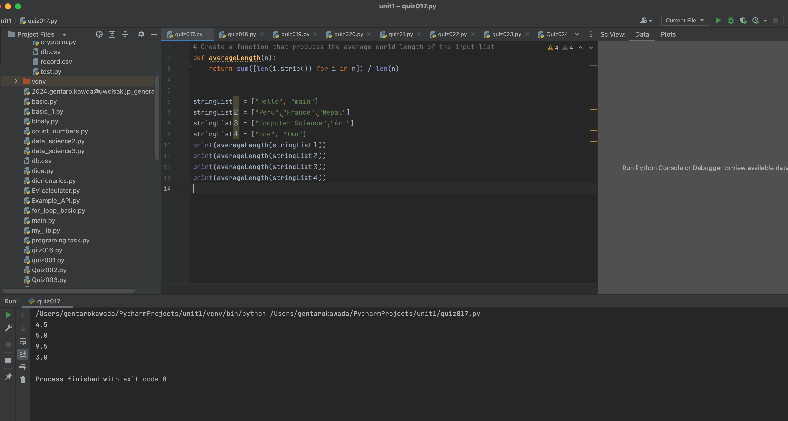
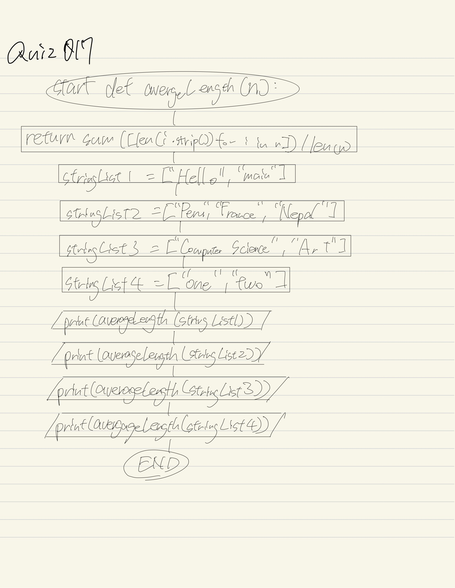

# Quiz017

## Create a function that produces the average word length of the input list

## :program
```.py
# Create a function that produces the average world length of the input list
def averageLength(n):
    return sum([len(i.strip()) for i in n]) / len(n)


stringList１ = ["Hello", "main"]
stringList２ = ["Peru","France","Nepal"]
stringList３ = ["Computer Science","Art"]
stringList４ = ["one", "two"]
print(averageLength(stringList１))
print(averageLength(stringList２))
print(averageLength(stringList３))
print(averageLength(stringList４))

```

## Fig.1


##Flowchart:

