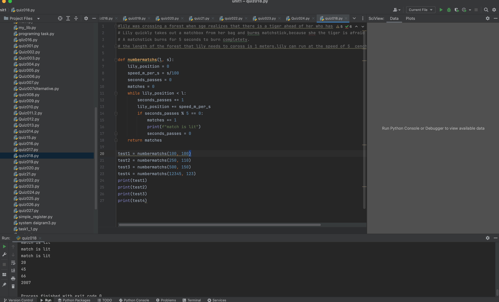

# Quiz018

## Create a function to help Lily

Lily was crossing a forest when she realizes that there is a tiger ahead of her who has seen Lily.
Lily quickly takes out a matchbox from her bag and burns a matchstick, because the tiger is afraid of fire.

A matchstick takes 5 seconds to burn completely.  The length of the forest that Lily needs to cross is "l" meters. Lily's speed is s cm/s

What is the minimum number of matchsticks Lily needs to burn to cross the forest safely?

| Input l:int s:int | Output:int   |
|-------------------|--------------|
| 100, 100          | 20 matches   |
| 250, 110          | 46 matches   |
| 500, 150          | 67 matches   |
| 12345, 123        | 2008 matches |


HL: Create the Truth table for the boolean equation

out = ABC+(A+B+C)+not(notA notB notC)

## :program
```.py
def numbermatchs(l, s):
    lily_position = 0
    speed_m_per_s = s/100
    seconds_passes = 0
    matches = 0
    while lily_position < l:
        seconds_passes += 1
        lily_position += speed_m_per_s
        if seconds_passes % 5 == 0:
            matches += 1
            print(f"match is lit")
            seconds_passes = 0
    return matches

test1 = numbermatchs(100, 100)
test2 = numbermatchs(250, 110)
test3 = numbermatchs(500, 150)
test4 = numbermatchs(12345, 123)
print(test1)
print(test2)
print(test3)
print(test4)

```


| Input | Output |
|-------|--------|
| 0 0 0 | 0      |
| 0 0 1 | 1      |
| 0 1 0 | 1      |
| 0 1 1 | 1      |
| 1 0 0 | 1      |
| 1 0 1 | 1      |
| 1 1 0 | 1      |
| 1 1 1 | 1      |

## Fig.1


##Flowchart:


