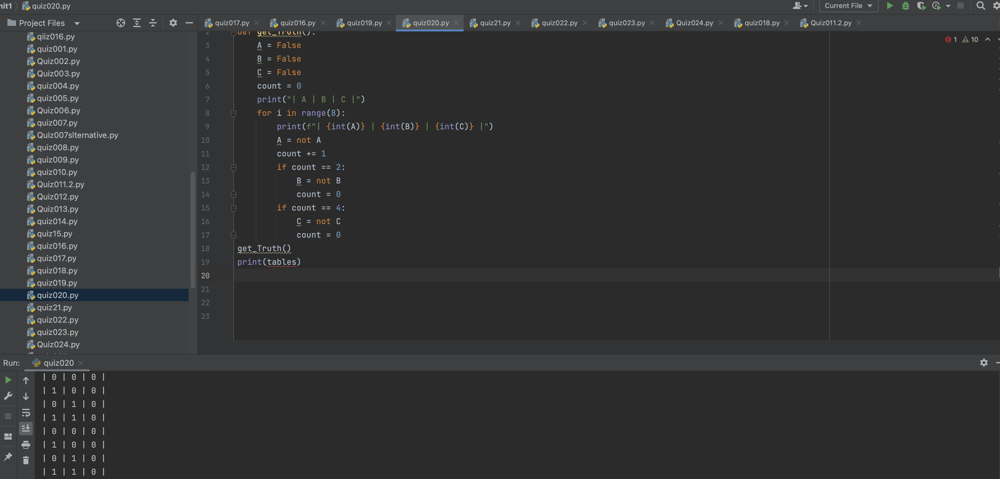
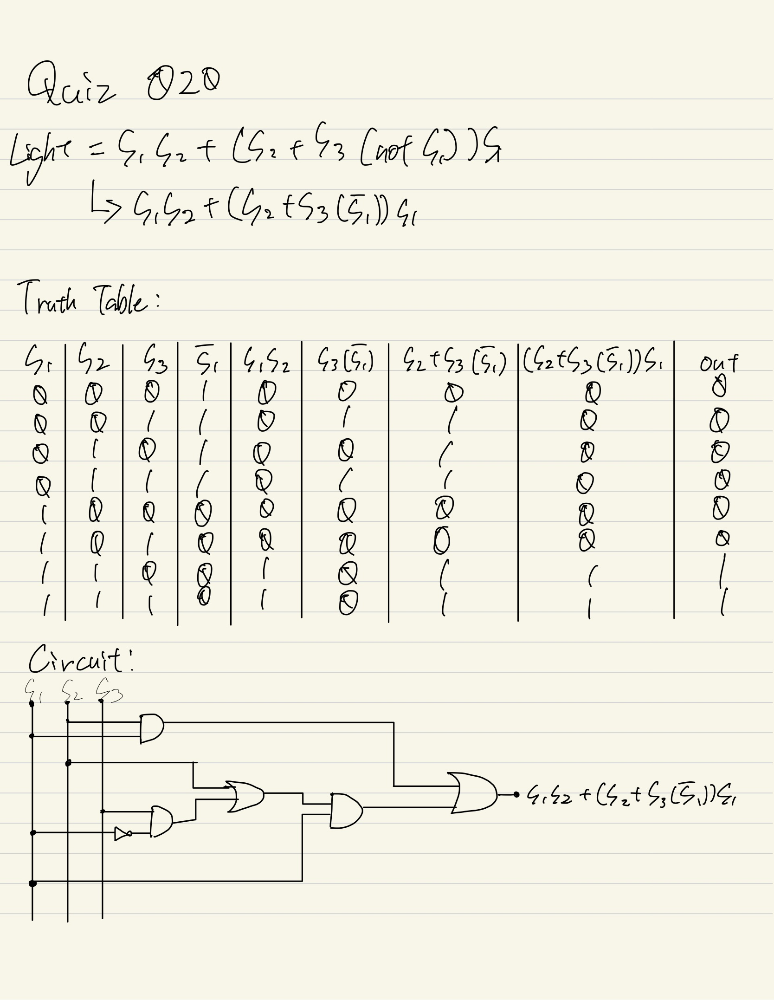

# Quiz020

## Create a function that produces the table of Truth for 3 inputs
## :program
```.py

def get_truth():
    A = False
    B = False
    C = True
    print('| A | B | C |')
    for i in range(8):
        C = not C
        if i == 2 or i == 4 or i == 6:
            B = not B
        if i == 4:
            A = not A
        print(f'| {int(A)} | {int(B)} | {int(C)} |')

```

## Fig.1


## Boolean Circuit:

