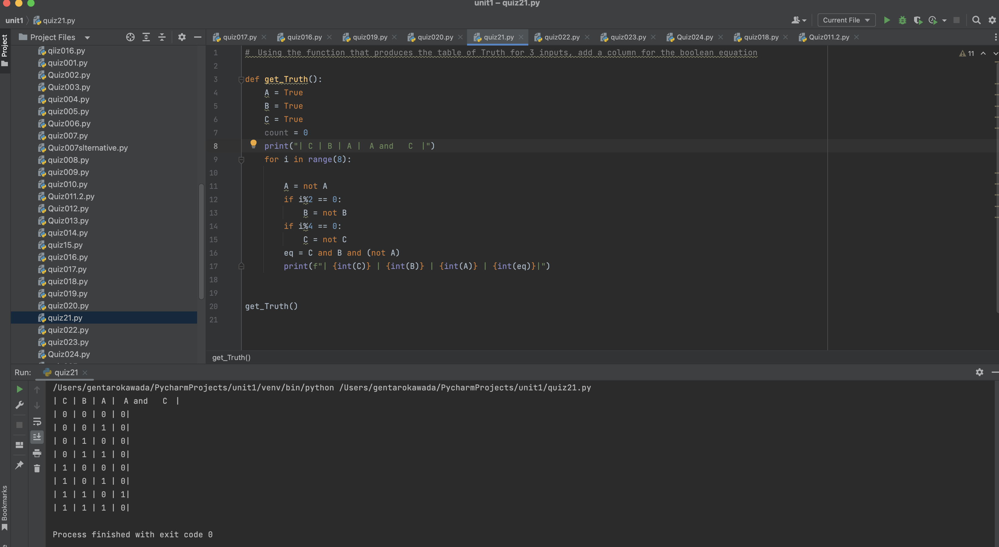
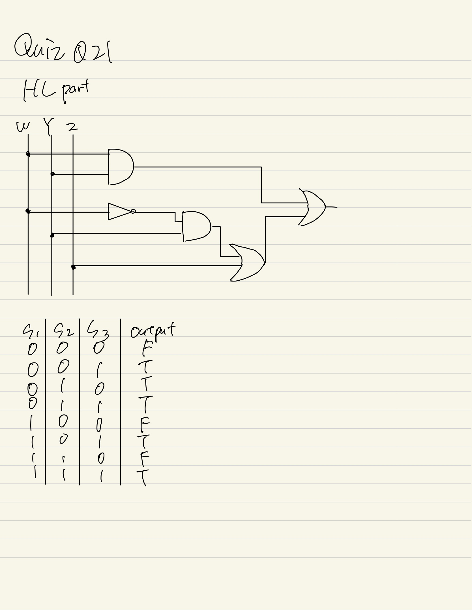

# Quiz021

## Using the function that produces the table of Truth for 3 inputs, add a column for the boolean equation

## :program
```.py
#　Using the function that produces the table of Truth for 3 inputs, add a column for the boolean equation

def get_Truth():
    A = True
    B = True
    C = True
    count = 0
    print("| C | B | A |　A and   C　|")
    for i in range(8):

        A = not A
        if i%2 == 0:
            B = not B
        if i%4 == 0:
            C = not C
        eq = C and B and (not A)
        print(f"| {int(C)} | {int(B)} | {int(A)} | {int(eq)}|")


get_Truth()

```

## Fig.1


## Boolean Circuit:


