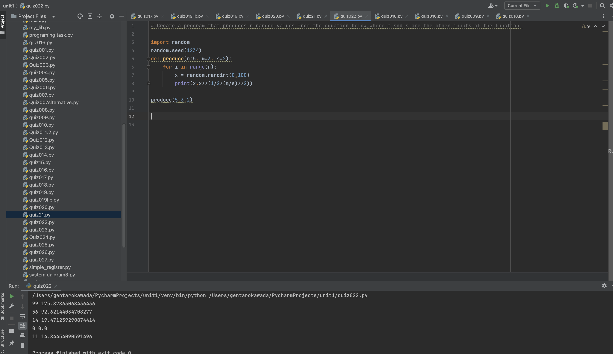

# Quiz022

## Create a program that produces n random values from the equation below, where m and s are the other inputs of the function 

## :program
```.py

import random
random.seed(1234)
def produce(n:5, m=3, s=2):
    for i in range(n):
        x = random.randint(0,100)
        print(x,x**(1/2*(m/s)**2))

produce(5,3,2)
```

## Fig.1


##Flowchart:

