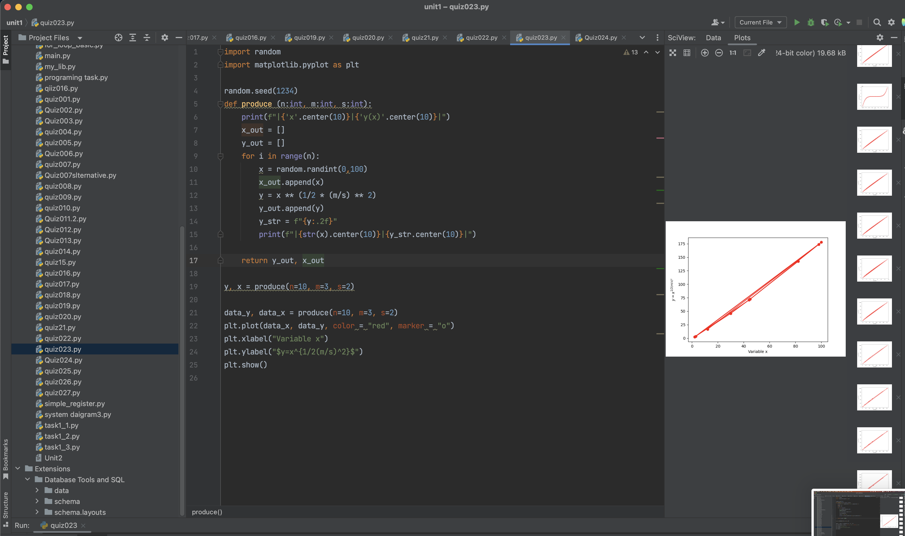

# Quiz023

## Create a program that produces n random values from the equation below , where m and s are the other inputs of the function

#### $y = x^{1/2*(m/s)^2}$

HL: Show A(A+B)=A


## :program
```.py
def numbermatchs(l, s):
    lily_position = 0
    speed_m_per_s = s/100
    seconds_passes = 0
    matches = 0
    while lily_position < l:
        seconds_passes += 1
        lily_position += speed_m_per_s
        if seconds_passes % 5 == 0:
            matches += 1
            print(f"match is lit")
            seconds_passes = 0
    return matches

test1 = numbermatchs(100, 100)
test2 = numbermatchs(250, 110)
test3 = numbermatchs(500, 150)
test4 = numbermatchs(12345, 123)
print(test1)
print(test2)
print(test3)
print(test4)

```


## Fig.1


##Flowchart:


