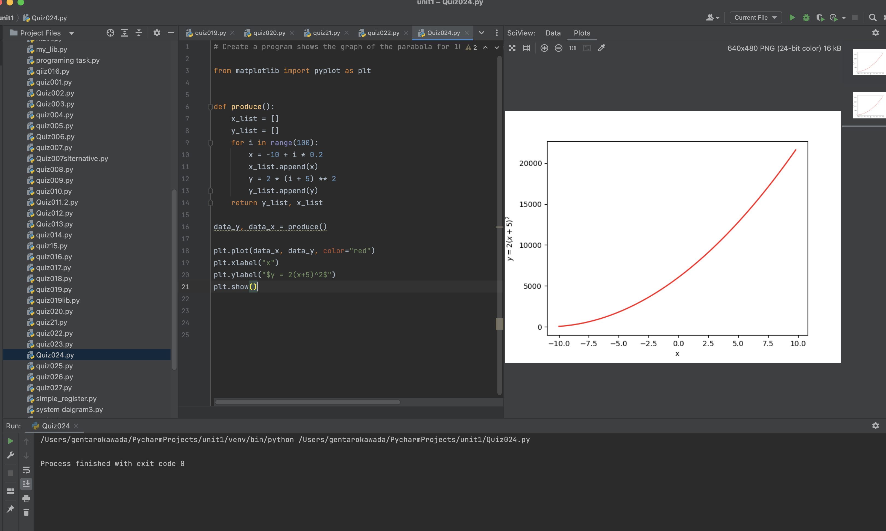
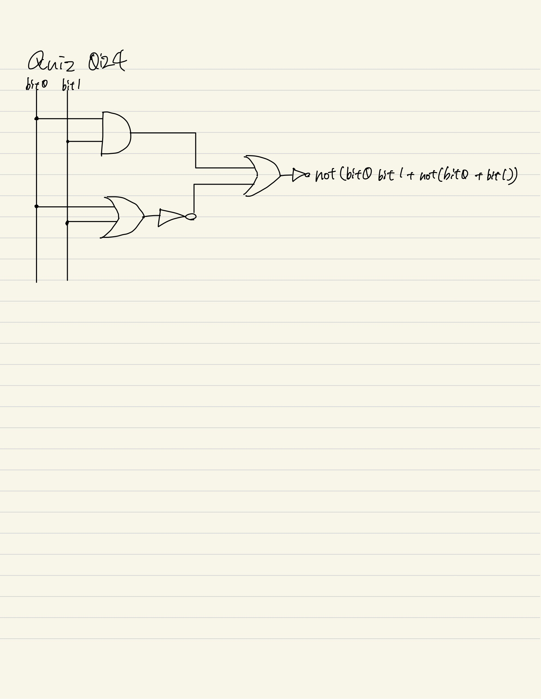

# Quiz024
Create a program that shows the graph of the parabola for 100 values of x in the interval of -10 to 10

**Equation: $y = 2(x+5)^2$**


## :program
```.py
# Create a program shows the graph of the parabola for 100 values of x in the interval -10 < x < 10

from matplotlib import pyplot as plt
x = []
y = []
for a in range(-100, 100,2):
    i = a/10
    x.append(i)
    y.append((i*5)**5)

plt.plot(x, y, color='red',marker='*')
plt.xlabel('x')
plt.ylabel('f(x)=2(x*5)^5')
plt.show()
```

## Fig.1


##Flowchart:

